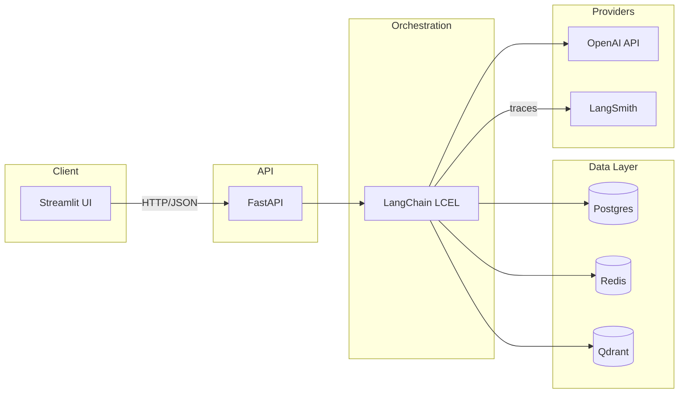

# AI Career Intelligence Assistant

A domain-specific career copilot that provides **retrieval-grounded** career guidance using trusted labor-market and skills data. Built with advanced RAG, tool calling, and a citation-first approach.

> **Sprint 2** — Advanced RAG + Tool Calling + Vector DB + Polished UI

---

## Architecture



## Key capabilities

| Feature | Description |
|---------|-------------|
| **Advanced RAG** | Query rewriting, metadata filtering, optional reranking, citation-grounded answers |
| **Tool calling** | Skill gap analyzer, role comparison, learning plan generator |
| **Vector search** | Qdrant with rich metadata payloads and filterable fields |
| **Safety** | Input/output guards, rate limiting, prompt-injection detection, weak-evidence abstain |
| **Observability** | Structured logging, LangSmith traces, evaluation hooks |

## Quickstart

### Prerequisites

- Python 3.11+
- [uv](https://docs.astral.sh/uv/) package manager
- Docker & Docker Compose

### 1. Clone and set up environment

```bash
git clone <repo-url> && cd career-intelligence
cp .env.example .env
# Fill in your OPENAI_API_KEY and other secrets in .env
```

### 2. Start infrastructure

```bash
docker compose up -d
```

### 3. Install dependencies

```bash
uv sync
```

### 4. Run the API

```bash
uv run uvicorn career_intel.api.main:app --reload
```

### 5. Run the Streamlit UI

```bash
uv run streamlit run streamlit_app/app.py
```

### 6. Run tests

```bash
uv run pytest
```

## Project structure

```
src/career_intel/
  config/        # Pydantic BaseSettings, env loading
  api/           # FastAPI routers and middleware
  orchestration/ # LangChain chains, prompts, orchestration logic
  rag/           # Ingestion, chunking, embeddings, retrieval, citation
  tools/         # Skill gap, role compare, learning plan
  security/      # Guards, rate limiting, prompt-injection detection
  storage/       # Postgres, Redis, Qdrant client wrappers
  logging/       # Structured logging setup
  schemas/       # Shared Pydantic models
  evaluation/    # Eval datasets, runners, metrics
streamlit_app/   # Streamlit frontend
tests/           # Unit, integration, RAG, tool, API, security tests
docs/            # Architecture, workflow, security, evaluation docs
```

## Documentation

- [Architecture](docs/architecture.md)
- [RAG Pipeline](docs/rag_pipeline.md)
- [Workflows](docs/workflows.md)
- [Security](docs/security.md)
- [Evaluation](docs/evaluation.md)

## Disclaimer

This assistant provides **guidance only** based on curated data sources. It does not guarantee employment outcomes, salaries, or career success. Consult a professional career advisor for high-stakes decisions.

## License

MIT
