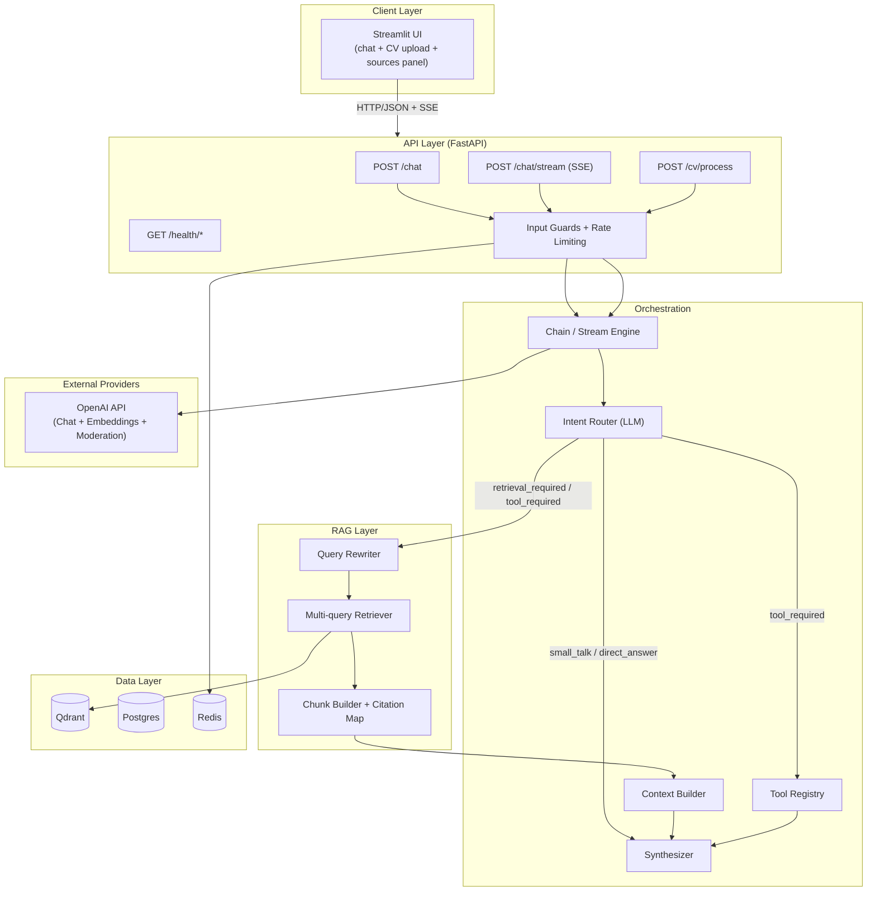
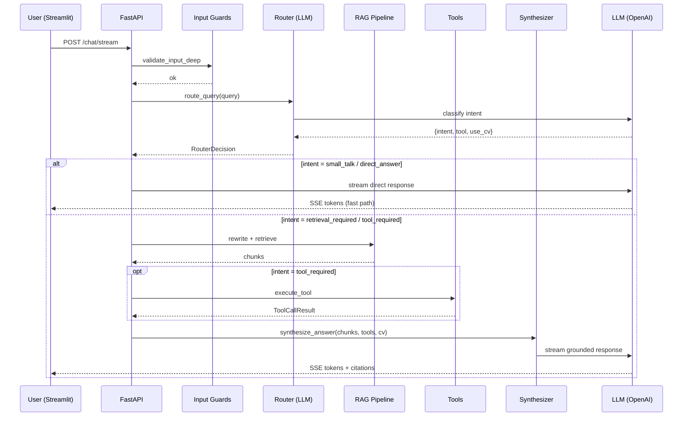
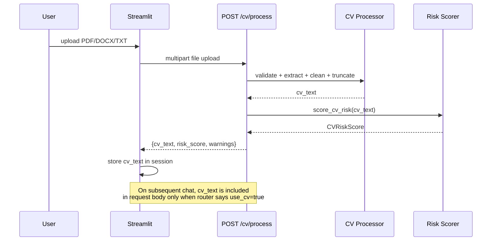

# AI Career Intelligence Assistant

A production-grade career copilot that provides **retrieval-grounded**, **CV-aware** career guidance using trusted labor-market and skills data. Built with intent-first routing, RAG, tool calling, streaming, and multi-layer security.

---

## Architecture



## Key capabilities

| Feature | Description |
|---------|-------------|
| **Intent-first routing** | LLM classifies intent (small_talk, direct_answer, retrieval_required, tool_required) before deciding actions |
| **Advanced RAG** | Query rewriting, multi-query retrieval, metadata filtering, weak-evidence abstention, citation-grounded answers |
| **CV-aware assistance** | Secure CV upload, token-safe processing, risk scoring, CV context included only when relevant |
| **Tool calling** | Skill gap analyzer, role comparison, learning plan generator |
| **End-to-end streaming** | SSE streaming with fast-path for conversational intents, status events for retrieval |
| **Multi-layer security** | Heuristic guards, encoded-attack detection, OpenAI moderation, structural sanitization, randomized boundaries, rate limiting |
| **Evaluation framework** | Golden dataset, routing accuracy checks, citation integrity, retrieval hit metrics |

## Quickstart

### Prerequisites

- Python 3.11+
- [uv](https://docs.astral.sh/uv/) package manager
- Docker & Docker Compose (for Qdrant, Postgres, Redis)

### 1. Clone and set up environment

```bash
git clone <repo-url> && cd Career_Consultant_Platform
cp .env.example .env    # fill in OPENAI_API_KEY and other secrets
```

### 2. Start infrastructure

```bash
docker compose up -d    # starts Qdrant, Postgres, Redis
```

### 3. Install dependencies

```bash
uv sync
```

### 4. Run the API

```bash
uv run uvicorn career_intel.api.main:app --reload
```

### 5. Run the Streamlit UI

```bash
uv run streamlit run streamlit_app/app.py
```

### 6. Run tests

```bash
uv run python -m pytest tests/ --ignore=tests/integration -v
```

## Project structure

```
src/career_intel/
  config/          # Pydantic BaseSettings, env loading
  api/             # FastAPI routers (chat, cv, health, ingest, feedback, evaluation, metrics)
  orchestration/   # Chain, stream engine, context builder, prompts, synthesizer
  rag/             # Ingestion, chunking, embeddings, retrieval, citation mapping
  tools/           # Intent-first router, skill gap, role compare, learning plan
  security/        # Multi-layer guards, sanitization, risk scoring, rate limiting
  services/        # CV processor (extract, clean, truncate)
  storage/         # Postgres, Redis, Qdrant client wrappers
  llm/             # Centralized LLM/embedding client factory with retry/backoff
  logging/         # Structured logging setup
  schemas/         # Shared Pydantic models (API + domain + routing)
  evaluation/      # Golden datasets, eval runner, routing accuracy, metrics
streamlit_app/     # Streamlit frontend
tests/             # Unit, orchestration, RAG, security, API, tool tests
docs/              # Architecture, security, evaluation, RAG pipeline docs
```

## Request lifecycle



## CV upload flow



## Documentation

- [Architecture](docs/architecture.md)
- [Security](docs/security.md)
- [RAG Pipeline](docs/rag_pipeline.md)
- [Evaluation](docs/evaluation.md)
- [Workflows](docs/workflows.md)

## Known limitations

- The router relies on a single LLM call; misclassification is possible for ambiguous queries
- Multilingual injection detection depends on OpenAI's moderation API coverage
- CV parsing supports PDF/DOCX/TXT only; scanned/image-only PDFs will fail
- No user authentication; sessions are browser-local
- Retrieval quality depends on the ingested knowledge base

## License

MIT
