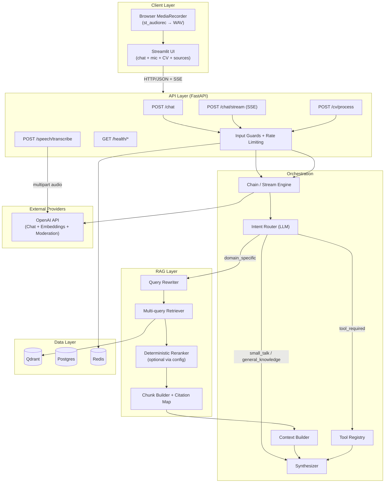
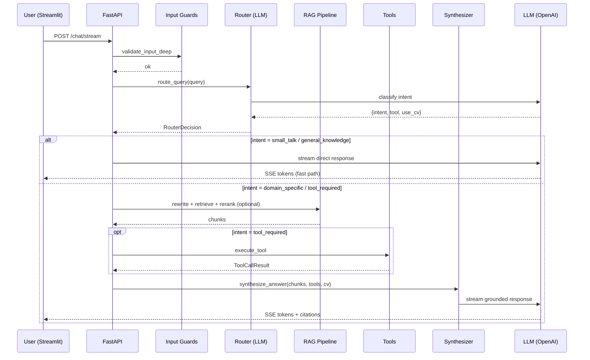
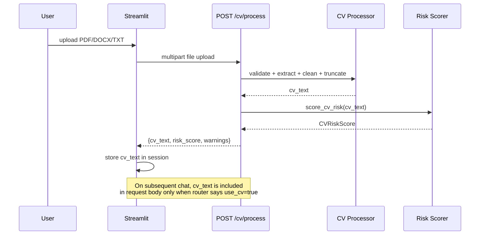
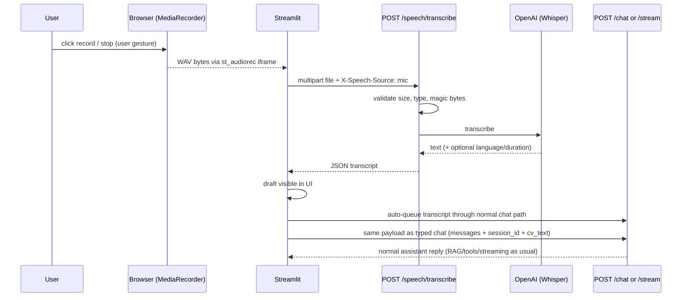

# AI Career Intelligence Assistant

A production-grade career copilot that provides **retrieval-grounded**, **CV-aware** career guidance using trusted labor-market and skills data. Built with intent-first routing, RAG, tool calling, streaming, and multi-layer security.

---

## Architecture



## Key capabilities

| Feature | Description |
|---------|-------------|
| **Intent-first routing** | LLM classifies intent (small_talk, general_knowledge, domain_specific, tool_required, dynamic_runtime) before deciding actions, with calibrated domain-trend bias for data/AI labor-market queries |
| **Advanced RAG** | Query rewriting, multi-query retrieval, profile-aware deterministic reranking, metadata filtering, weak-evidence abstention, citation-grounded answers |
| **CV-aware assistance** | Secure CV upload, token-safe processing, risk scoring, CV context included only when relevant |
| **Tool calling** | Skill gap analyzer, role comparison, learning plan generator |
| **End-to-end streaming** | SSE streaming with fast-path for conversational intents, status events for retrieval |
| **Speech-to-text** | In-app mic (`streamlit-audiorec` / MediaRecorder → WAV) or sidebar file upload → `POST /speech/transcribe` → editable transcript → normal chat pipeline |
| **Multi-layer security** | Heuristic guards, encoded-attack detection, OpenAI moderation, structural sanitization, randomized boundaries, output redaction, model-override allowlisting, scoped rate limiting |
| **Evaluation framework** | Golden dataset, routing accuracy checks, citation integrity, retrieval hit metrics |

## Quickstart

### Prerequisites

- Python 3.11 or 3.12 (recommended: 3.11.9 for Cloud parity)
- [uv](https://docs.astral.sh/uv/) package manager
- Docker & Docker Compose (for Qdrant, Postgres, Redis)

### 1. Clone and set up environment

```bash
git clone <repo-url> && cd Career_Consultant_Platform
cp .env.example .env    # fill in OPENAI_API_KEY and other secrets
```

### 2. Start infrastructure

```bash
docker compose up -d    # starts Qdrant, Postgres, Redis
```

### 3. Install dependencies

```bash
uv sync
```

### 4. (Optional) Run the API

```bash
uv run uvicorn career_intel.api.main:app --reload
```

### 5. Run the Streamlit UI (default direct mode)

```bash
uv run streamlit run streamlit_app/app.py
```

By default, the UI runs orchestration directly in-process (`STREAMLIT_DIRECT_MODE=true`).
Use external API mode only when explicitly needed:

```bash
export STREAMLIT_DIRECT_MODE=false
export CAREER_INTEL_API_BASE_URL=http://localhost:8000
uv run streamlit run streamlit_app/app.py
```

### 6. Run tests

```bash
uv run python -m pytest tests/ --ignore=tests/integration -v
```

## Project structure

```
src/career_intel/
  config/          # Pydantic BaseSettings, env loading
  api/             # FastAPI routers (chat, cv, speech, health, ingest, feedback, evaluation, metrics)
  orchestration/   # Chain, stream engine, context builder, prompts, synthesizer
  rag/             # Ingestion, chunking, embeddings, retrieval, citation mapping
  tools/           # Intent-first router, skill gap, role compare, learning plan
  security/        # Multi-layer guards, sanitization, risk scoring, rate limiting
  services/        # CV processor; speech transcription (isolated from orchestration)
  storage/         # Postgres, Redis, Qdrant client wrappers
  llm/             # Centralized LLM/embedding client factory with retry/backoff
  logging/         # Structured logging setup
  schemas/         # Shared Pydantic models (API + domain + routing)
  evaluation/      # Golden datasets, eval runner, routing accuracy, metrics
streamlit_app/     # Streamlit UI; audiorec bridge (keyed mic) + speech_client (HTTP to /speech/transcribe)
tests/             # Unit, orchestration, RAG, security, API, tool tests
docs/              # Architecture, security, evaluation, RAG pipeline docs
```

## Request lifecycle



## CV upload flow



## Speech-to-text flow

**Primary:** the main chat area embeds the [`streamlit-audiorec`](https://pypi.org/project/streamlit-audiorec/) component (browser **MediaRecorder** → WAV in the iframe). When you finish a clip, Python receives WAV bytes and calls `POST /speech/transcribe` with header `X-Speech-Source: mic`. A **keyed wrapper** (`streamlit_app/audiorec_bridge.py`) remounts the component after each clip so the same recording is not transcribed twice on every rerun.

**Fallback:** sidebar multipart upload with `X-Speech-Source: upload`.

In both cases, a successful transcript is inserted into the speech draft and then auto-queued through the normal chat path. If a draft remains visible after an interrupted send, you can still edit/resend or discard it. `POST /chat` and `POST /chat/stream` are unchanged.



### Configuration

| Variable | Purpose |
|----------|---------|
| `MAX_SPEECH_FILE_BYTES` | Max upload size (default 25 MB) |
| `SPEECH_ALLOWED_EXTENSIONS` | Comma-separated list (default `wav,mp3,m4a,webm`) |
| `OPENAI_TRANSCRIPTION_MODEL` | e.g. `whisper-1` |
| `SPEECH_TRANSCRIPTION_TIMEOUT_SECONDS` | Client timeout for the transcription HTTP call |
| `X-Speech-Source` (request header) | Optional: `mic` or `upload` for structured logs (`speech_upload_received`, `transcription_*`) |

### Manual test checklist (speech)

1. Start the API and `uv run streamlit run streamlit_app/app.py` (localhost is a secure context for `getUserMedia`).
2. Record a short phrase with the in-app recorder; confirm a transcript appears and is auto-queued through the usual chat path.
3. If a draft remains visible after an interrupted send, edit/resend or discard it and confirm the assistant responds through the usual chat/streaming path.
4. Click **Discard transcript** and confirm the draft clears and you can record again.
5. Block microphone in the browser; confirm the caption suggests sidebar upload; upload a small `.wav` and use **Transcribe file**.
6. Use **New** in the sidebar and confirm speech draft and mic remount state reset.

### API: `POST /speech/transcribe`

- **Request:** multipart field `file` (audio).
- **Success:** `{ "text", "provider", "language", "duration_seconds", "warnings" }`.
- **Errors:** `400` invalid/empty/corrupt, `413` too large, `422` empty transcript after normalization, `502` provider failure.
- **Development:** response may include header `X-Transcription-Latency-Ms`.

## Streamlit Community Cloud deployment

This repo supports **single-deployment Streamlit mode**: the UI executes backend orchestration in-process by default (`STREAMLIT_DIRECT_MODE=true`), so Streamlit Cloud does not require a separately reachable FastAPI service.

1. Ensure these files exist:
   - `streamlit_app/requirements.txt` (Streamlit + in-process backend runtime deps)
   - `runtime.txt` at repo root (`python-3.11.9`)
2. Keep the app directory free of conflicting dependency specs (no `pyproject.toml` / `uv.lock` inside `streamlit_app/`).
3. In Streamlit Community Cloud, set **Main file path** to `streamlit_app/app.py`.
4. Set secrets/environment variables in Streamlit Cloud:
   - `STREAMLIT_DIRECT_MODE=true` (recommended default)
   - `OPENAI_API_KEY`
   - data-store URLs needed by retrieval (for example `QDRANT_URL`)
5. Redeploy (or reboot) after changing dependencies or runtime.

### Required Streamlit secrets

- Basic chat (LLM): `OPENAI_API_KEY`
- Retrieval (RAG): `QDRANT_URL` (plus collection/name overrides if used)
- Speech transcription: `OPENAI_API_KEY`
- Optional external backend mode only: `CAREER_INTEL_API_BASE_URL` (when `STREAMLIT_DIRECT_MODE=false`)

### Optional external backend mode

If you intentionally run Streamlit against a separate FastAPI backend:
- set `STREAMLIT_DIRECT_MODE=false`
- set `CAREER_INTEL_API_BASE_URL` to the reachable backend URL
- keep `streamlit_app/app.py` as the Streamlit entrypoint

## Documentation

- [Architecture](docs/architecture.md)
- [Security](docs/security.md)

Production note: uploaded CV/audio inputs are validated before parsing or transcription, unsupported BYOK model overrides are rejected server-side, and citations do not expose local file paths.
- [RAG Pipeline](docs/rag_pipeline.md)
- [Evaluation](docs/evaluation.md)
- [Workflows](docs/workflows.md)

## Data sources

- **ESCO**: occupations, skills, occupation-skill relations, ISCO groups, and skills hierarchy are used to generate structured ESCO documents for retrieval.
- **WEF**: Future of Jobs reports (2018, 2020, 2023, 2025) are ingested for labor-market trends and demand signals.

## Evaluation

- **Golden dataset concept**: curated prompts cover domain-specific, fallback, and source-sensitive behaviors to detect regressions in routing and grounding.
- **RAGAS setup**: offline evaluation scripts score grounding and answer quality (faithfulness, relevancy, context precision/recall) and write timestamped reports under `reports/ragas/`.

## Known limitations

- The router relies on a single LLM call; ambiguous phrasing can still misclassify despite domain-trend calibration
- Multilingual injection detection depends on OpenAI's moderation API coverage
- CV parsing supports PDF/DOCX/TXT only; scanned/image-only PDFs will fail
- Mic capture requires a **secure context** (HTTPS or localhost); denied permissions show a short caption — use sidebar upload as fallback
- No live/streaming transcription (record → stop → batch transcribe only)
- No user authentication; sessions are browser-local
- ESCO coverage is still partial in some occupation-skill relation pathways
- YouTube integration is not yet available in the runtime retrieval path
- Retrieval sufficiency remains a gap for edge-case queries with sparse corpus evidence

## Next steps

- Improve routing robustness beyond single-pass intent classification.
- Add retrieval-quality gating to better detect insufficient evidence before synthesis.
- Extend corpus coverage (deeper ESCO backfill plus additional trusted external sources).

## RAG runtime flags

| Variable | Purpose |
|----------|---------|
| `RAG_ENABLE_RERANKING` | Enables post-retrieval deterministic reranking (`true` by default). When `false`, vector-search order is preserved and only top-k truncation is applied. |

### Profile-aware reranking behavior

- `esco_relation`: strong relation-centric reranking; prioritizes `relation_detail` / `relation_summary`.
- `esco_taxonomy`: taxonomy-pure reranking; strongly prioritizes `taxonomy_mapping` / `isco_group_summary` and penalizes low-signal relation bleed.
- `esco_general`: balanced lexical + metadata reranking across ESCO summaries and relations.
- `wef_general`: light reranking suitable for WEF report passages; no ESCO-specific boosts.

Profile selection occurs after retrieval candidate creation and before final `rag_top_k` chunk selection.

## License

MIT
