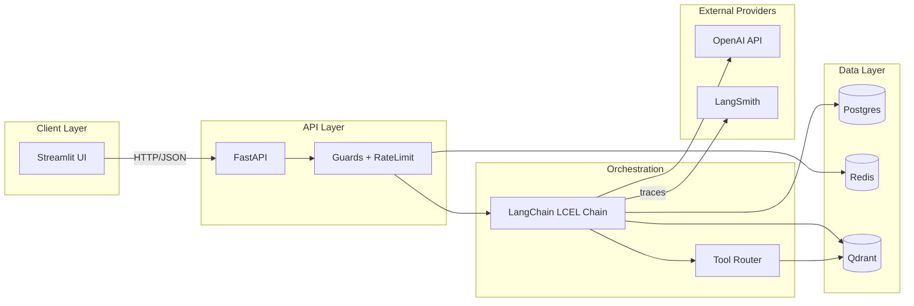

# System Architecture

## High-level overview

## Module boundaries

| Module | Responsibility |
|--------|---------------|
| `config/` | Environment-driven settings via Pydantic BaseSettings |
| `api/` | FastAPI app factory, routers, request/response contracts |
| `orchestration/` | LangChain chain composition, prompt management, tool dispatch |
| `rag/` | Ingestion pipeline, chunking, embeddings, retrieval, reranking, citation mapping |
| `tools/` | Structured tool implementations with Pydantic I/O |
| `security/` | Input/output guards, rate limiting, injection detection |
| `storage/` | Thin wrappers around Postgres, Redis, Qdrant clients |
| `logging/` | Structured logging via structlog |
| `schemas/` | Shared Pydantic models (API contracts + domain objects) |
| `evaluation/` | Golden datasets, eval runner, metrics |

## Key design decisions

1. **FastAPI over Flask** — native async, auto-generated OpenAPI docs, Pydantic-native.
2. **LangChain LCEL** — composable chains without heavy agent frameworks; easy to swap components.
3. **Qdrant** — rich metadata payloads with filterable fields; good Python SDK.
4. **Streamlit** — rapid iteration for sprint scope; acceptable UX with multi-panel layout.
5. **Stateless API** — Streamlit is a thin client; all state lives in Postgres/Redis.

## Sprint 3 upgrade path

- Replace LCEL chains with LangGraph for multi-step agent workflows.
- Add user authentication and multi-tenant support.
- Introduce hybrid retrieval (dense + sparse) in Qdrant.
