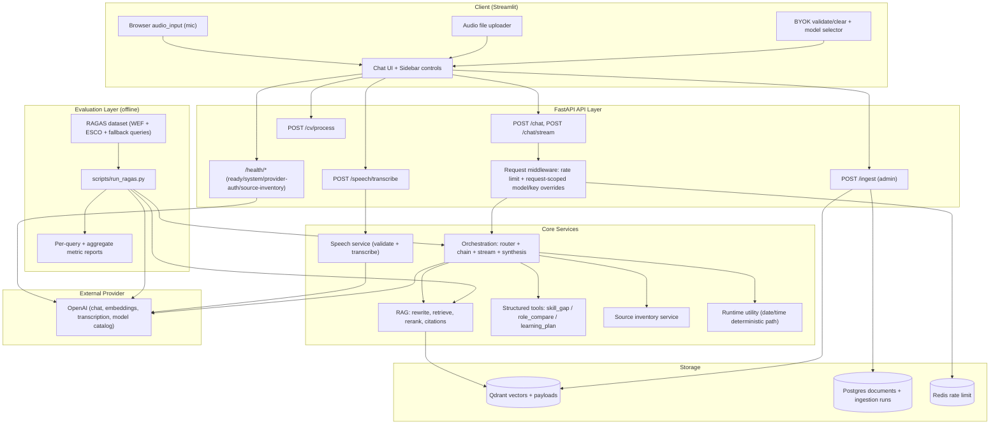
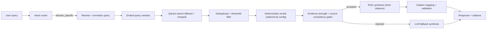
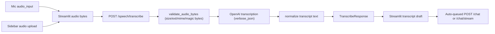

# System Architecture

This document reflects the current implementation in `src/career_intel` and `streamlit_app` after the recent ingestion, orchestration, speech, BYOK, source-inventory, and security-hardening updates.

## Full System Architecture

## Component Responsibilities and Contracts

## Security-Critical Boundaries

- **Request boundary:** FastAPI middleware applies request-scoped BYOK binding, model-override validation, and endpoint-specific rate limiting before handlers run.
- **Prompt boundary:** User input, CV text, retrieved chunks, and tool outputs are all treated as untrusted until they are sanitized/wrapped for synthesis.
- **Upload boundary:** CV and speech uploads are validated independently before any parser/provider call.
- **Presentation boundary:** External metadata and citation URIs are sanitized before they reach the Streamlit renderer.
- **Logging boundary:** Structured logs redact raw secrets and user-text previews by default.

### 1) Ingestion pipeline

- **What it does:** Indexes documents into Qdrant and tracks document/run lineage in Postgres.
- **Inputs:**  
  - API-triggered: `POST /ingest` with explicit file paths (`.md`, `.txt`, `.csv`) via `run_ingestion`.  
  - Raw corpus scripts: `scripts/ingest_raw.py` and `scripts/esco_backfill_live.py` via `ingest_raw_corpus`.
- **Outputs:** `IngestResponse` (`run_id`, `documents_processed`, `chunks_created`), Qdrant points, Postgres `documents` and `ingestion_runs`.
- **Connections:** Uses chunking, embeddings, and Qdrant upsert helpers; writes lineage to Postgres.

### 2) Chunking

- **What it does:** Converts documents into deterministic token-aware chunks (`RawChunk` with stable `chunk_id`).
- **Inputs:** Plain text / markdown / CSV rows / structured sections.
- **Outputs:** `list[RawChunk]` containing `text`, `metadata`, `chunk_id`.
- **Connections:** Used by ingestion and raw corpus ingest; chunk metadata feeds retrieval and citation generation later.

### 3) Embeddings

- **What it does:** Generates OpenAI embeddings for text batches through a centralized client with retry logging.
- **Inputs:** `list[str]` chunk/query text + embedding model config.
- **Outputs:** `list[list[float]]` vectors.
- **Connections:** Called by ingestion (document vectors) and retrieval (query vectors).

### 4) Qdrant storage

- **What it does:** Ensures collection, upserts vectors, performs filtered similarity search, counts and diagnostic sampling.
- **Inputs:** Vector IDs, vectors, payloads, optional metadata filters.
- **Outputs:** Stored points, `ScoredPoint` search results, diagnostics (`count`, payload samples).
- **Connections:** Central vector store for RAG retrieval and ingestion verification.

### 5) Retrieval

- **What it does:** Rewrites/normalizes queries, creates multi-variant embeddings, merges search hits, deduplicates, applies thresholds, and source-consistency checks.
- **Inputs:** User query, optional filters, runtime settings, optional source/query-profile overrides.
- **Outputs:** `list[RetrievedChunk]` with similarity scores and normalized metadata.
- **Connections:** Feeds reranking, evidence-strength assessment, and synthesis citation mapping.

### 6) Reranking

- **What it does:** Deterministic profile-aware rerank using vector score + lexical/title overlap + profile-specific metadata boosts.
- **Inputs:** Query string + retrieved chunks.
- **Outputs:** Reordered chunks with `rerank_score`; retrieval then applies final top-k truncation.
- **Connections:** Called inside retrieval before final chunk selection.
- **Runtime flag:** `rag_enable_reranking` (default `true`). If disabled, retrieval keeps vector-search order and sets `rerank_score = score`.
- **Profiles:**
  - `esco_relation`: strong boost for relation docs (`relation_detail`, `relation_summary`) with extra exact-skill lexical boost for ESCO relation queries.
  - `esco_taxonomy`: strong boost for taxonomy docs (`taxonomy_mapping`, `isco_group_summary`) with relation-bleed penalty unless taxonomy signal is strong.
  - `esco_general`: balanced lexical + metadata reranking.
  - `wef_general`: light reranking with no ESCO-specific boosts.

### 7) Synthesis

- **What it does:** Generates final answers in one of three grounded modes:
  - `rag`: strict citation-required generation with retry on invalid/missing citations.
  - `tool`: summarizes tool outputs without fabricated citations.
  - `llm_fallback`: general reasoning with explicit non-grounded disclaimer.
- **Inputs:** Query, rewritten query, retrieved chunks, tool results, answer source, CV context flag.
- **Outputs:** `reply` text + `citations` list (RAG mode only).
- **Connections:** Called from both non-streaming chain and streaming path.
- **Security notes:** Retrieved context and CV blocks are wrapped as untrusted data; output is post-processed to redact prompt-leak and secret-like artifacts; citation URIs are limited to public HTTP(S) links.

### 8) Orchestration (RAG / TOOL / FALLBACK + runtime/source-inventory)

- **What it does:** Enforces intent-first routing and selects execution path:
  - `small_talk`, `general_knowledge` -> fast LLM fallback path.
  - `domain_specific` -> rewrite/retrieve/rerank/evidence gating -> RAG or fallback.
  - `tool_required` -> structured tool execution -> tool synthesis or fallback.
  - `dynamic_runtime` -> deterministic runtime utility (date/time).
  - Source-inventory query short-circuit -> direct inventory answer.
- **Inputs:** Chat messages, session context, optional CV text, optional timezone.
- **Outputs:** `ChatResponse` (or SSE events for stream).
- **Connections:** Uses guards, router, retriever, tools, runtime utility, source inventory, and synthesis.

### 9) Speech pipeline

- **What it does:** Speech-to-text only; validates audio, returns a normalized transcript, and the client auto-queues it through the normal chat path.
- **Inputs:** Multipart audio upload (`wav/mp3/m4a/webm/mp4`) + optional `X-Speech-Source` header.
- **Outputs:** `TranscribeResponse` (`text`, `provider`, optional language/duration, warnings).
- **Connections:** Isolated from retrieval/orchestration; transcript only enters guard/orchestration when sent as regular chat text.

### 10) BYOK flow

- **What it does:** Allows per-request OpenAI key/model overrides without persisting server config.
- **Inputs:** Streamlit BYOK validation call to `/health/provider-auth`; request headers `X-OpenAI-API-Key`, `X-OpenAI-Model`.
- **Outputs:** Validated credential source state, selectable model catalog, request-scoped override binding.
- **Connections:** FastAPI middleware sets contextvars for current request; `llm/clients.py` resolves key/model from request override first, then app defaults.
- **Security notes:** Backend validates model overrides against a server allowlist, the UI clears the raw BYOK input after successful validation, and logs mask secret-like values.

### 11) Source inventory system

- **What it does:** Answers source-coverage questions without vector search; inspects known raw source files and ESCO backfill log status.
- **Inputs:** Source inventory query text (chat) or `/health/source-inventory` endpoint request.
- **Outputs:** Structured source summary and user-facing source inventory answer text.
- **Connections:** Used by health endpoint and orchestration short-circuit path.

### 12) Evaluation layer (RAGAS)

- **What it does:** Runs offline quantitative evaluation of response grounding quality without changing production retrieval/generation flow.
- **Inputs:** Curated evaluation dataset in `src/career_intel/evaluation/datasets/ragas_queries.json` containing WEF, ESCO relation, ESCO taxonomy, and fallback queries with expected answers/contexts.
- **Outputs:** Per-query and aggregate metrics (`faithfulness`, `answer_relevancy`, `context_precision`, `context_recall`) written to timestamped reports under `reports/ragas/`.
- **Connections:** `scripts/run_ragas.py` calls existing orchestration and retrieval interfaces to collect responses/contexts, then scores with RAGAS.
- **Operational notes:** This layer is offline-only and does not alter runtime routing, retrieval, reranking, or synthesis logic.

## RAG Pipeline (Detailed)

## Speech Pipeline (Detailed)

## BYOK Validation and Request Override Flow

```mermaid
flowchart LR
    UI["User enters key in Streamlit"] --> VAL["GET /health/provider-auth with key+model headers"]
    VAL --> LIST["Backend lists provider models"]
    LIST --> NORM["Normalize supported/selectable models"]
    NORM --> RES["Auth status returned to UI"]
    RES --> SEL["UI selects available model"]
    SEL --> CHAT["Chat request with X-OpenAI-API-Key + X-OpenAI-Model"]
    CHAT --> MW["FastAPI request middleware binds contextvars"]
    MW --> LLM["llm.clients resolves key/model (override first)"]
    LLM --> OPENAI["OpenAI APIs"]
```

## Data Sources and Transformation

### WEF reports

- **Raw sources:**  
  - `data/raw/wef/WEF_Future_of_Jobs_2018.pdf`  
  - `data/raw/wef/WEF_Future_of_Jobs_2020.pdf`  
  - `data/raw/wef/WEF_Future_of_Jobs_2023.pdf`  
  - `data/raw/wef/WEF_Future_of_Jobs_Report_2025.pdf`
- **Transformation path:** PDF page extraction -> header/footer cleanup -> section detection -> token chunking -> embeddings -> Qdrant payload with metadata (`source=wef`, title, section/page/topic/year).

### ESCO datasets

- **Raw sources:**  
  - `data/raw/esco/occupations_en.csv`  
  - `data/raw/esco/skills_en.csv`  
  - `data/raw/esco/occupationSkillRelations_en.csv`  
  - `data/raw/esco/ISCOGroups_en.csv`  
  - `data/raw/esco/skillsHierarchy_en.csv`
- **Transformation path:** Enriched document synthesis from linked occupation-skill-relation records -> generated ESCO document types -> token chunking -> embeddings -> Qdrant payload with taxonomy metadata (`occupation_id`, `skill_id`, `isco_group`, `esco_doc_type`).
- **Current generated ESCO document types:** `occupation_summary`, `skill_summary`, `relation_detail`, `taxonomy_mapping`, `isco_group_summary`.

## Orchestration Paths and Runtime Modes

- **RAG path:** `domain_specific` query with sufficient evidence -> `answer_source="rag"` and citations.
- **TOOL path:** `tool_required` with successful tool execution -> `answer_source="tool"`.
- **FALLBACK path:** insufficient/blocked evidence or non-domain conversational intents -> `answer_source="llm_fallback"`.
- **RUNTIME path:** deterministic date/time queries -> `answer_source="runtime"` (no retrieval).
- **SOURCE_INVENTORY path:** source coverage questions -> `answer_source="source_inventory"` (no retrieval/tool).

### Routing calibration: domain trend bias

- A targeted router calibration biases broad data/AI labor-market and skills-trend prompts toward `domain_specific` retrieval-first handling.
- The bias applies only when trend, data/AI, and career-context signals co-occur, which keeps generic chat prompts on fallback paths.
- This reduces false fallback decisions on trend-oriented career questions while preserving existing intent categories and execution paths.

## Retrieval Runtime Knobs

- `rag_initial_top_k`: candidate breadth before reranking/selection.
- `rag_top_k`: final chunk count passed to synthesis.
- `rag_enable_reranking`: toggles deterministic reranker on/off.
- `rag_similarity_threshold`, `rag_strong_evidence_threshold`, `rag_rerank_coherence_threshold`: grounding gates after retrieval/reranking.
- Rerank policy is selected per query profile (`esco_relation`, `esco_taxonomy`, `esco_general`, `wef_general`) after source/query profiling and before final top-k selection.

## Known Limitations and Next Improvements

- **Reranking improvements:** Current reranker is deterministic and lightweight; consider hybrid semantic reranking or cross-encoder for higher precision on ambiguous queries.
- **ESCO coverage depth:** ESCO ingestion is improved but still partial for some long-tail occupation-skill relationship slices.
- **YouTube integration:** External video/course corpus ingestion is not present yet; pipeline currently covers WEF and ESCO only.
- **Retrieval sufficiency gap:** Some queries still fail to meet strong evidence thresholds due to sparse or weakly aligned chunks.
- **Citation UI:** Citations are shown in side panel cards, but richer in-message citation interaction (jump-to-source, grouped evidence views) is still limited.
- **Chunk tuning:** Token windows are globally configured; corpus-specific adaptive chunk sizing/overlap is not yet implemented.
- **Answer length control:** No explicit user-facing verbosity/length controls in orchestration prompts yet; response length is mainly model/prompt driven.
- **Prompt injection:** The app now has layered defenses and stricter prompt/output hygiene, but semantic prompt injection remains an open risk that requires monitoring and ongoing evaluation.

### Near-term next steps

- Improve routing robustness with broader intent calibration coverage and regression evaluation.
- Add retrieval quality gating to tighten fallback decisions when evidence is insufficient.
- Extend corpus breadth/depth (additional ESCO coverage and other trusted labor-market sources).
