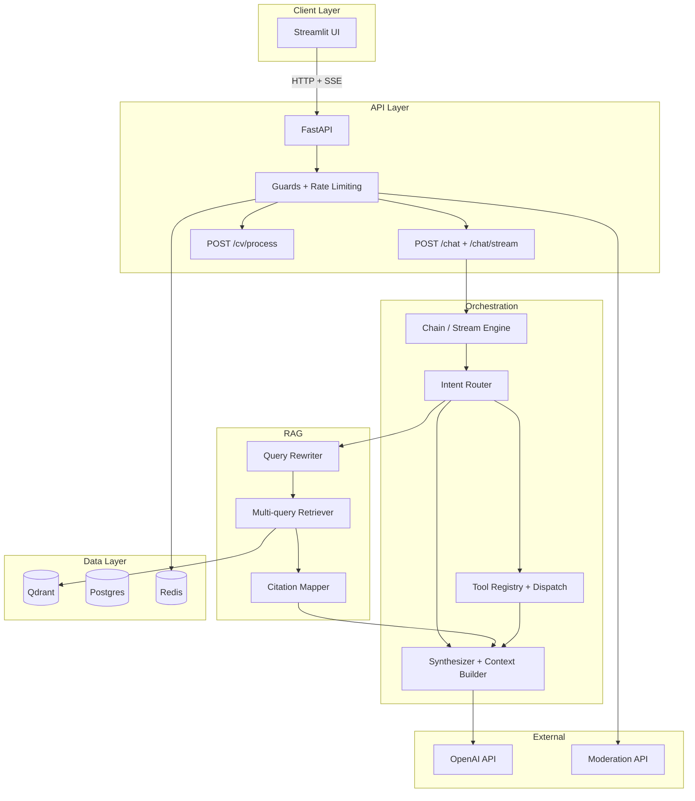

# System Architecture

## High-level overview

## Module boundaries

| Module | Responsibility |
|--------|---------------|
| `config/` | Environment-driven settings via Pydantic BaseSettings |
| `llm/` | Centralized LLM/embedding client factory with retry/backoff |
| `api/` | FastAPI app factory, routers (chat, cv, health, ingest, feedback, evaluation, metrics) |
| `orchestration/` | Intent-first chain composition, streaming engine, prompt management, context builder |
| `rag/` | Ingestion, chunking, embeddings, multi-query retrieval, citation mapping |
| `tools/` | Intent-first router, structured tool implementations (skill gap, role compare, learning plan) |
| `security/` | Multi-layer guards, structural + behavioral sanitization, CV risk scoring, rate limiting |
| `services/` | CV processing (extract, clean, truncate with token budget) |
| `storage/` | Thin wrappers for Postgres, Redis, Qdrant clients |
| `schemas/` | Shared Pydantic models — API contracts, domain objects, routing decisions, CV risk |
| `evaluation/` | Golden datasets, routing accuracy, citation integrity, retrieval hit metrics |

## Intent-first routing

The router classifies every query into one of four intents **before** any retrieval or tool execution:

| Intent | Retrieval | Tools | CV | Streaming |
|--------|-----------|-------|-----|-----------|
| `small_talk` | No | No | No | Fast-path (immediate tokens) |
| `direct_answer` | No | No | No | Fast-path (immediate tokens) |
| `retrieval_required` | Yes | No | If relevant | Normal (status → tokens → citations) |
| `tool_required` | Yes | Yes | If relevant | Normal (status → tool results → tokens → citations) |

## Streaming design

Two paths through the streaming engine:

1. **Fast path** (small_talk / direct_answer): Router → LLM stream immediately. No retrieval latency. First token in ~500ms.
2. **Normal path** (retrieval / tool): Router → status event → rewrite + retrieve → optional tool → LLM stream. First token after retrieval (~1-2s).

SSE event types: `intent`, `status`, `token`, `citations`, `tool_calls`, `done`, `error`.

## Key design decisions

1. **Intent-first routing** — classify *what the user wants* before deciding *how to serve it*. Eliminates unnecessary retrieval for greetings.
2. **Separate fast path** — small_talk/direct_answer skip retrieval entirely for near-instant responses.
3. **Backend CV processing** — `POST /cv/process` handles extraction, cleaning, truncation, and risk scoring server-side.
4. **Structural + behavioral sanitization** — structural patterns always stripped; behavioral patterns scored but not destroyed.
5. **Randomized boundaries** — per-request cryptographic boundary tokens prevent delimiter-spoof attacks.
6. **Centralized LLM clients** — all OpenAI calls go through `llm/clients.py` with retry/backoff.
7. **Streaming + non-streaming** — `POST /chat` for testing/eval; `POST /chat/stream` for production UX.

## Upgrade path

- LangGraph for multi-step agent workflows
- User authentication and multi-tenant support
- Hybrid retrieval (dense + sparse) in Qdrant
- Fine-tuned injection detection model
- Persistent conversation memory
