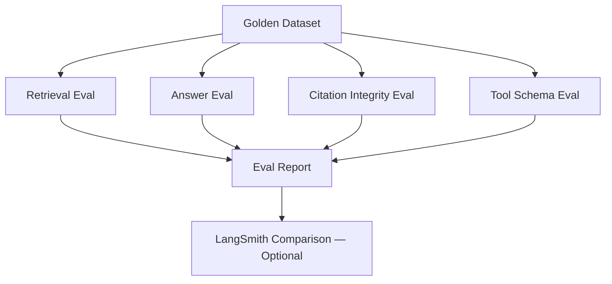

# Evaluation Strategy

## Evaluation pipeline

## Evaluation dimensions

| Dimension | Metrics | Method |
|-----------|---------|--------|
| Retrieval quality | nDCG@k, MRR | Gold query→chunk_id labels |
| Answer quality | Rubric-based LLM judge | Deterministic + LLM-as-judge |
| Citation integrity | Precision/recall vs gold sources; cited_ids ⊆ retrieved_ids | Deterministic |
| Tool correctness | Schema validation, fixture-based expected outputs | Deterministic |
| Safety | Injection resistance, refusal on unsupported claims | Deterministic |

## Golden dataset

Located at `src/career_intel/evaluation/datasets/golden_queries.json`.

Each entry contains:
- `query`: the user question
- `expected_chunk_ids`: chunk IDs that should appear in retrieval
- `expected_citations`: source IDs that should be cited
- `expected_behaviour`: e.g. "abstain", "use_tool:skill_gap", "cite_source"
- `tags`: category labels for filtering

## Early evaluation (Phase 3)

Introduced alongside the RAG pipeline:
- Retrieval smoke tests (do gold chunks appear in top-k?)
- Citation integrity checks (cited IDs are subset of retrieved IDs)
- Weak-evidence / abstain test cases
- Run via `pytest tests/rag/`

## Evolving toward RAGAs / TruLens

The `evaluation/` module exposes stable interfaces. Adding RAGAs or TruLens later requires only an adapter — no change to the golden dataset format or eval runner contract.
