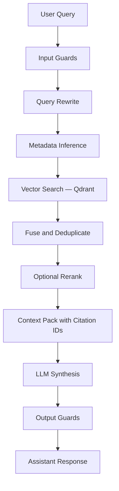

# RAG Pipeline

## Pipeline overview



## What makes this "advanced" RAG

| Technique | Description |
|-----------|-------------|
| Query rewriting | Clarify intent, expand acronyms, remove noise |
| Metadata filtering | Filter by year, source type, occupation code |
| MMR / diversity | Avoid redundant chunks in context window |
| Optional reranking | Cross-encoder on top-k candidates |
| Citation contract | Every factual claim must cite `[n]` |
| Calibrated refusal | Abstain or ask clarifying question when evidence is weak |
| Evaluation hooks | Retrieval and answer metrics wired from Phase 3 |

## Ingestion pipeline

```
raw files → normalize → extract text/tables → chunk → enrich metadata → embed → upsert Qdrant → record lineage in Postgres
```

### Chunking strategy

- **Reports:** 800–1200 tokens, 10–15% overlap, heading-aware splits.
- **Tables:** One row per chunk (or grouped by occupation for small rows). Never split primary keys across chunks.
- **Taxonomies:** Concept-centric small chunks with stable IDs.

### Metadata (per chunk payload in Qdrant)

`source_id`, `source_type`, `title`, `section`, `page_or_loc`, `publish_year`, `license`, `occupation_code`, `skill_id`, `uri`, `chunk_index`, `parent_doc_id`

## Retrieval flow

1. Input guard validation
2. Query rewrite (LLM-assisted)
3. Infer metadata filters from query
4. Embedding search in Qdrant (top-k=20)
5. Optional second query (multi-query fusion)
6. Fuse and deduplicate results
7. Optional cross-encoder rerank (top 8)
8. Build context window with pre-labeled citation IDs
9. LLM synthesis with citation contract prompt
10. Output guard: validate citations reference retrieved chunk IDs

## Citation format

Inline `[n]` references mapped to source cards containing: title, section, year, excerpt, URI.
