# Security Architecture

## Security pipeline

```mermaid
flowchart LR
    req["Incoming Request"] --> val["Pydantic Validation"]
    val --> len["Length + Content Limits"]
    len --> L1["Layer 1: Heuristic Regex"]
    L1 --> L2["Layer 2: Encoded Attack Detection"]
    L2 --> L3["Layer 3: OpenAI Moderation"]
    L3 --> rl["Redis Rate Limiting"]
    rl --> router["Intent Router"]
    router --> ctx["Context Builder"]
    ctx --> san["Structural Sanitization<br/>+ Randomized Boundaries"]
    san --> llm["LLM Call"]
    llm --> og["Output Guards"]
    og --> resp["Safe Response"]
```

## Multi-layer input guards

| Layer | Implementation | Latency | Fail mode |
|-------|---------------|---------|-----------|
| **1 — Heuristic regex** | 10+ compiled patterns for injection phrases, HTML tags, role-play | <1ms | Block on match |
| **2 — Encoded attacks** | Base64 decode + check, Unicode BiDi, zero-width chars | <1ms | Block on match |
| **3 — Moderation classifier** | OpenAI moderation API for paraphrased/multilingual attacks | 100-300ms | Fail-open if unreachable |
| **Rate limiting** | Redis sorted-set sliding window, keyed by IP + session | <5ms | Dev: fail-open; Prod: fail-closed |

## CV security

### Upload validation
- File type whitelist: `.pdf`, `.docx`, `.txt` only
- Size limit: 5 MB (configurable via `max_cv_file_bytes`)
- Empty file / empty filename rejection

### Sanitization (two-tier)

| Tier | Action | Examples |
|------|--------|---------|
| **Structural** (always stripped) | Remove delimiter-like markers | `[INST]`, `<\|im_start\|>`, `<<<...>>>`, `<BOUNDARY_...>`, `---`, `### System` |
| **Behavioral** (scored, not stripped) | Risk-score injection phrases | "ignore instructions", "override rules", "reveal system prompt" |

### Risk scoring
- Each behavioral pattern carries a weight (0.0–1.0)
- Score = max weight of matched patterns
- Flagged if score >= 0.5
- Risk score returned in `/cv/process` response for caller decision
- Flagged CVs logged (without content) for monitoring

### Prompt boundaries
- Per-request randomized boundary tokens via `secrets.choice`
- CV wrapped in `<BOUNDARY_xxx:USER_CV>` with explicit "DATA ONLY" instruction
- System prompt rules 8-10 instruct the LLM to treat boundary content as passive data

## Output guards

| Guard | Implementation |
|-------|---------------|
| Citation integrity | Validate `[n]` references map to retrieved chunk IDs |
| Schema validation | Tool outputs validated against Pydantic schemas |
| Weak evidence abstention | Template response when all retrieval scores < 0.30 |

## Rate limiting

- **Backend:** Redis sorted-set sliding window
- **Keys:** `ratelimit:ip:{client_ip}` and `ratelimit:session:{session_id}`
- **Applied to:** `/chat`, `/chat/stream`, `/ingest`, `/feedback`
- **Dev fallback:** fail-open when Redis unavailable
- **Production:** fail-closed (503)

## Secret management

- All secrets via environment variables, loaded through Pydantic `SecretStr`
- Admin endpoints require `X-Admin-Secret` header
- CV content never logged — only metadata (filename, byte size, risk score)
- `.env` excluded from version control

## Known limitations

- Heuristic regex is English-only; multilingual injection relies on Layer 3 (moderation API)
- OpenAI moderation is designed for content policy, not prompt injection specifically
- Novel attack vectors (encoded, Unicode homoglyphs) may bypass all layers
- Very short/ambiguous injections may evade heuristics
- Defense-in-depth via sanitization and output guards remains essential
