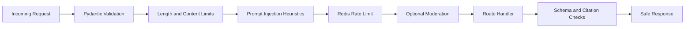

# Security Architecture

## Security pipeline

## Input guards

| Guard | Implementation |
|-------|---------------|
| Schema validation | Pydantic v2 models with field constraints |
| Length limits | `max_input_length` from settings; per-field max on schemas |
| Content sanitization | Strip HTML, normalize encoding |
| Prompt injection | Heuristic pattern matching on known injection patterns |
| Rate limiting | Redis sliding window, per IP/session, configurable RPM |
| Moderation | Optional OpenAI moderation API call |

## Output guards

| Guard | Implementation |
|-------|---------------|
| Citation enforcement | Validate `[n]` references map to retrieved chunk IDs |
| Schema validation | Tool outputs validated against Pydantic schemas |
| Weak evidence | Template response when retrieval scores are below threshold |

## Secret management

- All API keys and secrets loaded via environment variables only.
- `SecretStr` in Pydantic settings prevents accidental logging.
- Admin endpoints require `X-Admin-Secret` header.
- Secrets never appear in logs, error responses, or traces.
- `.env` excluded from version control via `.gitignore`.

## Security event logging

Events logged (without PII content):
- `rate_limited` — IP/session, endpoint, count
- `validation_failed` — field, constraint, truncated input length
- `injection_flagged` — pattern matched, session_id
- `auth_failed` — endpoint, reason
- `moderation_flagged` — categories, session_id

## Domain safety

- No guarantees on hiring outcomes, salaries, or career success.
- Disclaimer shown in UI and appended to first assistant message.
- Salary/demand data only from knowledge base; refuses fabrication.
