# Security Architecture

## Threat surface overview

The app’s main security boundaries are:

1. `POST /chat` and `POST /chat/stream` user input.
2. Uploaded CV and speech files before parsing/transcription.
3. Retrieved RAG chunks and CV text before they enter synthesis.
4. BYOK request headers (`X-OpenAI-API-Key`, `X-OpenAI-Model`).
5. External metadata rendered in the UI (for example YouTube titles, links, thumbnails).
6. Logs, health endpoints, citations, and source inventory metadata.

The design goal is practical defense-in-depth: block obvious abuse early, treat all retrieved or uploaded content as untrusted data, and fail safely without degrading normal RAG retrieval, reranking, embeddings, or Qdrant behavior.

## Security pipeline

```mermaid
flowchart LR
    req["Incoming Request"] --> val["Pydantic Validation"]
    val --> len["Length + Upload Limits"]
    len --> rl["Scoped Rate Limit"]
    rl --> ig["Input Guards"]
    ig --> router["Router / Retrieval / Tools"]
    router --> san["Context Sanitization + Boundary Wrapping"]
    san --> llm["LLM Call"]
    llm --> og["Output Validation + Redaction"]
    og --> resp["Safe Response"]
```

## Protections implemented

### 1. Prompt injection defense

| Layer | Implementation | Behavior |
|-------|---------------|----------|
| User-input heuristics | Regex screening for prompt override, hidden prompt probing, developer-message extraction, chain-of-thought requests, and encoded attacks | Block request with a generic rephrase message |
| Encoded attack checks | Base64 keyword scan, BiDi controls, zero-width character detection | Block request |
| Moderation classifier | OpenAI moderation as a secondary safety layer | Block on flag; fail-open only if upstream moderation is unavailable |
| System prompt hardening | Explicit rules that retrieved chunks, CVs, source inventory data, and external metadata are untrusted reference material only | Prevents model from treating content as instructions |
| Boundary wrapping | Randomized `<BOUNDARY_...>` wrappers around retrieved context and CV content | Stops delimiter spoofing and role-breakout attacks |
| Retrieval sanitization | Structural delimiter stripping plus control-character removal before synthesis | Preserves facts while neutralizing prompt-like framing |

Notes:

- Retrieved chunks are wrapped as untrusted reference material, not executable instructions.
- CV content is treated as data only and never as tool/system/user instructions.
- Graceful refusal is intentionally generic so the app does not leak internal rules while rejecting abusive prompts.

### 2. File upload validation

#### CV uploads

- Strict allowlist: `.pdf`, `.docx`, `.txt`.
- File-size limit: `max_cv_file_bytes` (default 5 MB).
- Safe filename normalization strips path segments and control characters before logging or parsing.
- Fake extension defense:
  - PDF must start with `%PDF-`.
  - DOCX must be a valid zip archive containing `word/document.xml`.
  - TXT rejects binary/null-byte payloads.
- Parser failures return generic client-safe errors without backend exception details.

#### Speech uploads

- Strict extension and MIME checks.
- Basic magic-byte checks for declared audio type.
- Safe filename normalization before logs/provider calls.
- Transcripts remain untrusted until the user submits them through the normal chat path.

### 3. Output validation and sanitization

- Prompt-boundary markers are stripped from model output.
- Output lines that expose hidden prompt material, developer messages, chain-of-thought, or internal scratchpad content are removed.
- Secret-like values are redacted from output if they appear.
- If a severe leak leaves no safe content, the app falls back to a short refusal rather than returning internal data.
- RAG answers must cite valid retrieved chunks; invalid citation IDs are rejected during generation.
- Citations only expose public HTTP(S) URIs. Local file paths are not returned to clients.

### 4. API key and secret handling

- All backend secrets load through Pydantic `SecretStr`.
- Structured logs pass through a redaction processor that masks secrets and strips raw user-text previews.
- BYOK keys are request-scoped on the backend via context variables and are not persisted in server config.
- The Streamlit BYOK input field is cleared immediately after successful validation.
- Unsupported model overrides are rejected server-side, even if a client bypasses UI controls.
- Admin authentication uses constant-time comparison.
- In staging/production, admin endpoints fail closed if the default admin secret is still configured.

### 5. Rate limiting and abuse prevention

Backend rate limiting uses Redis sliding windows keyed by both IP and session ID, with separate scopes:

- `chat`: `/chat`, `/chat/stream`
- `speech`: `/speech/*`
- `provider_auth`: `/health/provider-auth`
- `feedback`: `/feedback`
- `ingest`: `/ingest`

Defaults:

- Chat: 30 rpm
- Speech: 10 rpm
- BYOK validation: 10 rpm
- Feedback: 20 rpm
- Ingest: 5 rpm

Fail behavior:

- Development: Redis outage fails open for availability.
- Staging/production: Redis outage fails closed with HTTP 503.

The Streamlit client also keeps lightweight per-session throttles for chat, BYOK validation, and optional YouTube enrichment so the UI can back off before sending unnecessary traffic.

### 6. Retrieval context and source sanitization

- Retrieved chunks pass through structural delimiter stripping and control-character cleanup.
- Citation metadata is preserved, but local-path URIs are removed from client payloads.
- Source inventory returns file basenames only, not repo-relative or absolute paths.
- Admin-triggered ingestion is constrained to the configured raw-data root (`data/raw` by default).

### 7. External source safety

- YouTube suggestions stay UI-only and never enter the RAG context.
- Titles/channel names are HTML-escaped before rendering.
- Video links are restricted to YouTube hosts.
- Thumbnail links are restricted to trusted thumbnail host suffixes.
- Invalid or suspicious links are dropped instead of rendered.

### 8. Logging hygiene

- Raw API keys and secret-like strings are masked automatically.
- Raw user query previews are replaced with content-free descriptors in structured logs.
- CV text, transcripts, and model responses are not logged in full.
- Health endpoints return reduced dependency-error detail outside development.
- Remaining verbose console traces are limited to development-only paths.

### 9. Secure defaults

- Supported chat models are restricted by backend allowlist.
- Default answer mode remains grounded and citation-aware when evidence exists.
- External enrichment silently disables when its key is missing.
- Debug-oriented dependency details are suppressed outside development.
- Admin routes are unusable in staging/production until a non-default secret is configured.

## Recommended production deployment practices

1. Run behind a trusted reverse proxy that sets `X-Forwarded-For` correctly.
2. Use TLS for all client-to-backend traffic, especially when BYOK is enabled.
3. Store `OPENAI_API_KEY`, `ADMIN_SECRET`, and database credentials in a real secret manager.
4. Keep Redis highly available; production rate limiting intentionally fails closed if Redis is down.
5. Disable public access to admin ingestion routes except from trusted operator networks.
6. Keep `environment=production` and avoid development logging in deployed environments.
7. Monitor repeated 400/403/429 responses as likely abuse or probing.

## Remaining limitations

- Heuristic prompt-injection screening is still strongest in English.
- OpenAI moderation is not purpose-built for prompt injection and remains a secondary control.
- Sophisticated semantic prompt injections can still appear inside otherwise legitimate documents.
- Client-side YouTube throttling is a UX safeguard, not a trusted enforcement boundary.
- The UI stores a validated BYOK key in Streamlit session state for the active session by design.

## Validation checklist covered in tests

- Prompt-injection attempts and hidden-prompt exfiltration patterns.
- Fake CV upload cases (malformed PDF/DOCX, binary TXT).
- Secret masking and log redaction helpers.
- Endpoint-specific rate-limit policy mapping.
- Output leakage redaction for prompt/secret artifacts.
- Unsafe external metadata rendering and URL rejection.
