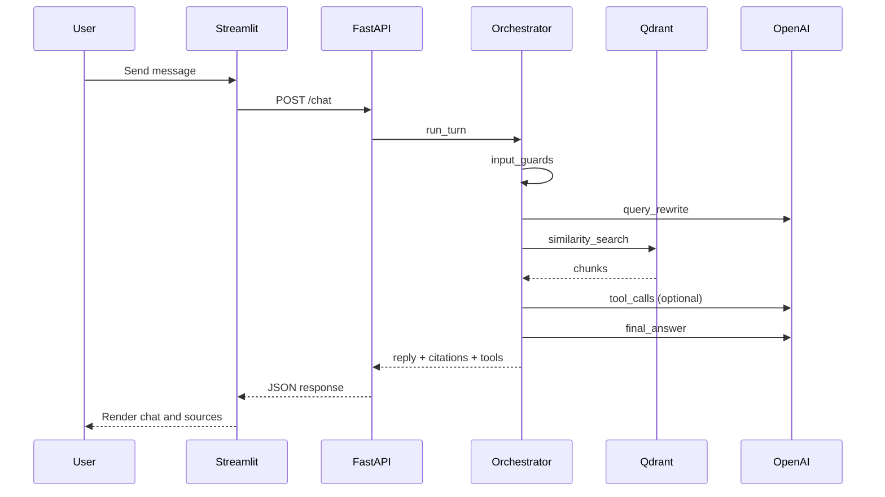
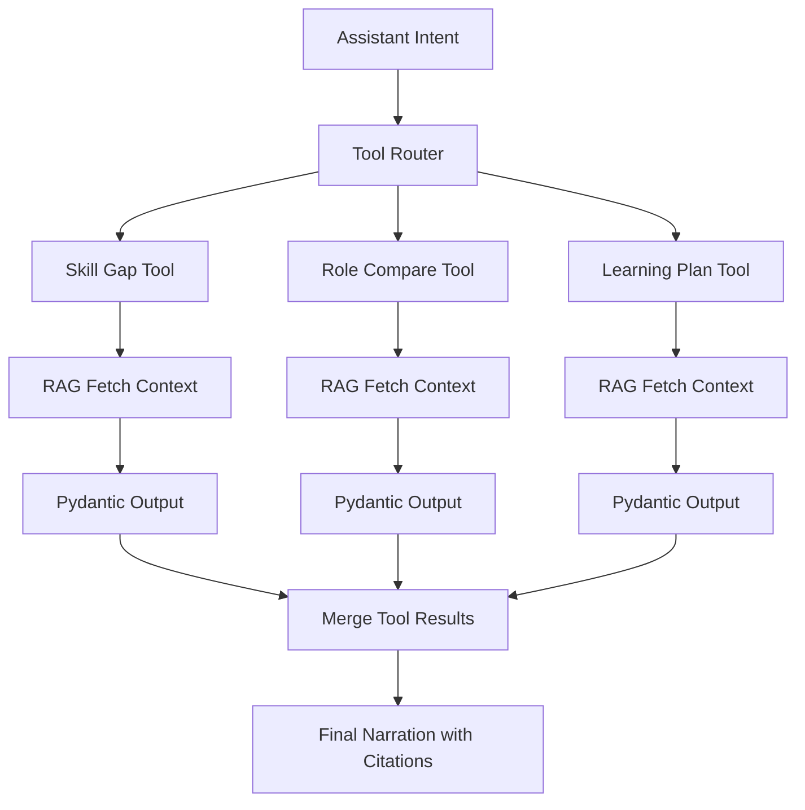

# Workflows

## Chat request sequence

## Tool calling flow

## Tool dispatch policy

1. The orchestrator inspects the LLM's function-call decision.
2. Requested tool must be in the registered tool set.
3. Tool input is validated against its Pydantic schema.
4. Tool executes (may trigger RAG sub-retrieval).
5. Tool output is validated and merged into the final response.
6. If a tool fails, the orchestrator returns a graceful fallback message.
